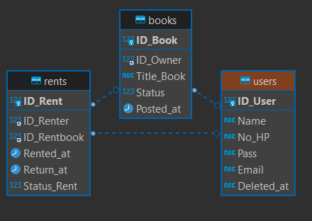
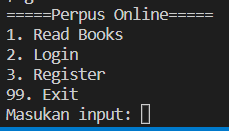
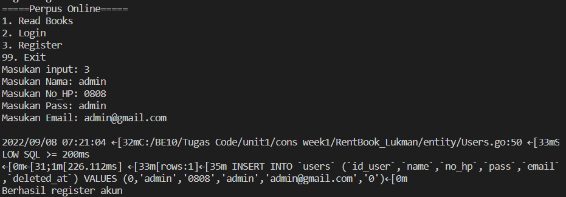
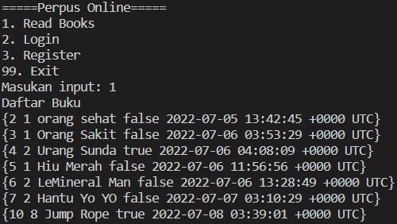
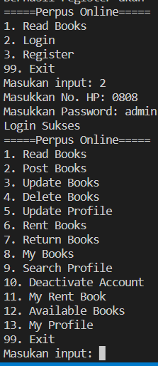

## RENT BOOK PROJECT

Project ini menggunakan bahasa pemrograman `Golang` berbasis CLI.

Database yang digunakan adalah `MySQL` dengan ORM GORM.

## 📜 Table of contents

- [General info](#ℹ️-general-info)
- [Technologies](#%EF%B8%8F-technologies)
- [ERD](#-erd)
- [Features](#-Features)
- [Demo](#-demo)
- [Installation](#%EF%B8%8F-installation)
- [Contributors](#-contributors)

## Features

1. Read Books
   Menampilkan semua daftar bacaan buku untuk dibaca oleh user.

2. Login
   Melakukan login akun untuk mengakses fitur lebih lengkap.

3. Register
   Melakukan registrasi akun apabila user belum memiliki akun.

4. Post Books
   User dapat membagikan buku miliknya agar dapat dibaca semua orang.

5. Update Books
   User dapat memperbarui data bukunya.

6. Delete Books
   User dapat menghapus buku miliknya.

7. Update Profile
   User dapat memperbarui informasi pribadi.

8. Rent Books
   User dapat meminjam buku dari user lain.

9. Return Books
   User mengembalikan buku sesuai ketentuan yang berlaku.

10. My Books
    Menampilkan daftar buku user yang telah dibagikan.

11. Search Profile
    User dapat menjelajah profile milik orang lain.

12. Deactive Account
    User menghapus akun.

13. My Rent Book
    Menampilkan daftar buku yang telah dipinjam oleh user.

14. Available Books
    Menampilkan buku yang dapat dipinjam.

15. My Profile
    Menampilkan data akun pribadi.

16. Exit
    User keluar dari program.

## ℹ️ General info

Rent Book dibuat untuk membantu pengguna melakukan peminjaman buku

## 🛠️ Technologies

- [Golang](https://go.dev)
- [Draw.io](/readme/erd.PNG)
- [GORM](https://gorm.io/)

## 📱 ERD

<p align="center">

</p>

## 🌐 Demo

<p align="center">




</p>

## ⚙️ Installation

- Clone this project

```bash
  git clone https://github.com/ALTA-BE10-Lukman-Hafidz/RentBook.git
```

- Run project

```bash
  cd RentBook

  go get

  go run main.go
```

## 🧑‍💻 Contributors

The following is a list of contributors to this project

[Lukman Hafidz](https://github.com/lukmanhafidz) - [Dian Nurdiana](https://github.com/DianNurdiana-alt)
